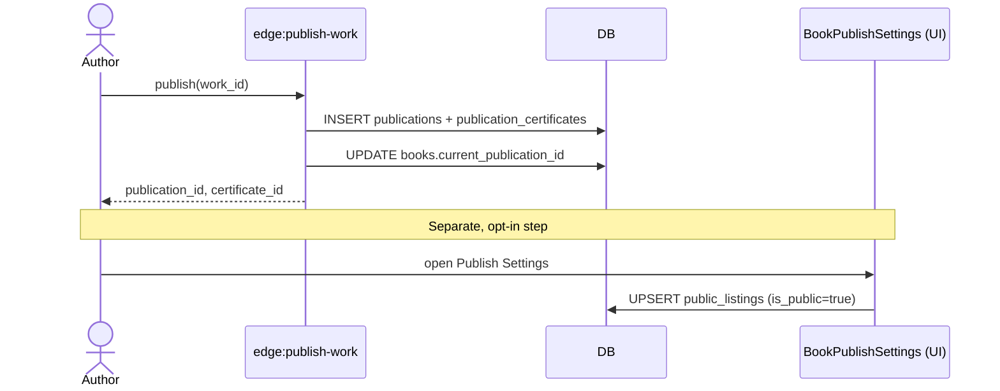
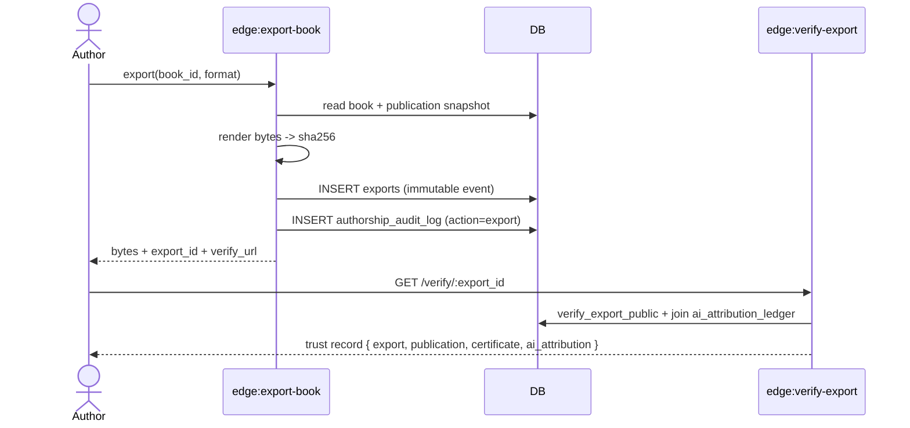

# ScrollLibrary — Lifecycles

ScrollLibrary contains three overlapping but independent product lifecycles.
They intersect through shared identifiers (`work_id`, `publication_id`,
`book_id`) but **must remain decoupled** in code and data.

---

## 1. Publication Lifecycle (Publishing OS)

```
Draft  →  Publish  →  Certificate  →  Verify
```

| Stage | Tables written | Functions |
|---|---|---|
| Draft | `books`, `chapters` | generate-*, chief-editor-* |
| Publish | `publications` (status=`published`, snapshot, content_hash), `books.current_publication_id` | `publish-work` |
| Certificate | `publication_certificates` | `publish-work`, `generate-publication-certificate` |
| Export event | `exports` (append-only), `authorship_audit_log` | `export-book`, `export-publication`, `export-certificate` |
| Verify | read-only via `verify_export_public` RPC | `verify-export` |

Invariants:
- Once a publication row is written, its `snapshot` and `content_hash` are immutable.
- Every successful render writes one new row to `exports`. Repeated exports are **new events**, never updates.
- `authorship_audit_log` is append-only (no UPDATE/DELETE policy).
- AI attribution lives once in `ai_attribution_ledger` and is **referenced** by `publication_id` — never duplicated into `exports`.

## 2. Commercial Lifecycle (Commerce OS)

```
Publication  →  Storefront Listing  →  Checkout  →  Purchase  →  Earnings
```

| Stage | Tables | Notes |
|---|---|---|
| List | `public_listings` (UPSERT by `book_id`) | Author opt-in, gated by author profile, price, quality |
| Checkout | `purchase_intents` | created by storefront |
| Purchase | `book_purchases`, `purchases`, `book_reviews` | webhook-driven |
| Earnings | `creator_earnings_ledger`, `creator_revenue_daily` | nightly |

Invariants:
- A published work is **never** auto-listed. Listing is an explicit author action.
- A listing without a published publication is allowed (drafts can be paywalled).
- Listing visibility (`is_public`) is independent of publication status.

## 3. Learning Lifecycle (Learning OS)

```
Read  →  Mastery  →  Certification
```

Tables: `reading_progress`, `competency_progress`, `competency_certificates`, `spaced_repetition_cards`, `quiz_attempts`. Independent of commerce; does not require a public listing.

---

## Why these are decoupled

| Concern | Owned by |
|---|---|
| Authorship & moral rights | Publishing OS (`work_authors`, `work_rights`, `rights_history`) |
| Discoverability & money | Commerce OS (`public_listings`, `purchases`, payouts) |
| Reader progress & competency | Learning OS |

Mixing them is the most common source of regressions in this codebase.
When in doubt: a change is "publishing" if it touches `works`, `publications`,
`exports`, or `certificates`; "commerce" if it touches `public_listings`,
`purchases`, or payouts; "learning" if it touches reader progress or mastery.

---

## Sequence — Publish → Listing



## Sequence — Publish → Export → Verify


